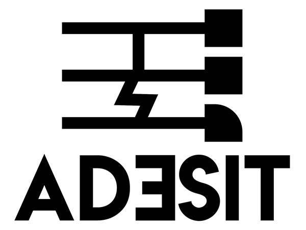

# 

Suppose you are facing a new supervised learning (SL) challenge: a domain expert asks you if it is possible to predict a **target C** from a set of **features X** by learning on a **dataset r**. 
To answer this question, it is common for a data scientist to directly jump into the learning step by training a model and  then evaluate it against a testing set to obtain an accuracy.
If this approach might work, the interpretability of the result is generally rather low: *Why such accuracy, where the errors come from? Could you obtain a better one with a different model or settings?*
Moreover, it can also be very costly as answering such questions might require many trainings.

With ADESIT, we propose a tool to better understand your data beforehand in view of that SL problem, allowing to avoid many costly training and to obtain a deeper insight on your data. We target questions such as:
* What areas of my data might present a problem?
    * How the domain expert could explain those issues and provide potential solutions?
    * How incorporating domain knowledge such as accuracies changes my results?
* What maximum accuracy should I excpect from my trainings?
* What features are the most discriminant?

In practice, ADESIT is a visual tool which proposes multiple counterexample indicators as well as an interactive visual counterexample exploration to better understand the potential strengths and weaknesses of the project. A demonstration version of ADESIT is available at [adesit.datavalor.com](https://adesit.datavalor.com/).

## Starting guide

ADESIT is coded in Python (>=3.7) based on the Dash framework.
Counterexample analysis is powered by the [fastg3](https://github.com/datavalor/fastg3) python library.
Once it is launched, ADESIT is available on port 8050.

### Regular

```
pip install -r deploy/requirements.txt
cd dash/
python app.py -d -t -b
```

* -d: debut logs
* -b: no banner
* -t: no time limit

### Docker

```
cd deploy/
docker-compose up
```

## Authors and developers

The demonstration paper associated with ADESIT is named *"ADESIT: Visualize the Limits of your Data in a Machine Learning Process"* and is in proceedings of VLDB 21 (International Conference on Very Large Data Bases). 
Full version of this paper is available [here](https://pastel.archives-ouvertes.fr/LIRIS/hal-03242380v1).

* Pierre Faure--Giovagnoli (pierre.faure--giovagnoli@insa-lyon.fr)
* Marie Le Guilly
* Jean-Marc Petit
* Vasile-Marian Scuturici

We thank Matteo Dumont and Antoine Mandin for their help on the initial development of ADESIT. We also thank Benjamin Bertin and Vincent Barellon for testing the application and their help for its deployment. Finally, we thank the Datavalor initiative at INSA Lyon for funding a part of this work.
